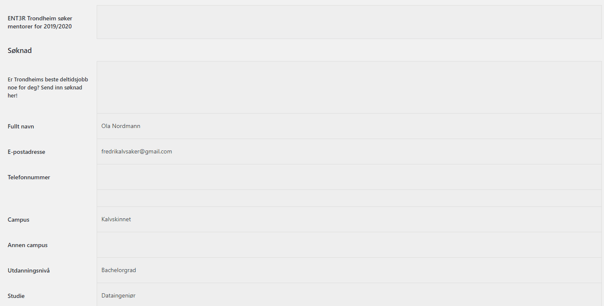

<!DOCTYPE html>
<html>
    <body>
        <!-- LOGO  -->
        

            
        

        <!-- INGRESS -->
        

            <h1 align="center">Brukerinstruks for søknadsvurderingsskjema</h1>
            

                Søknadsvurderingsskjemaet ble utviklet våren 2019 og 2020 for å bedre
                måten kandidater til mentorstilling i ENT3R Trondheim ble vurdert på.
                Særlig ble det lagt fokus på at de som vurderer en kandidat ikke skal
                se hverandres vurdering for å unngå ubevisst påvirkning.
                Søknads-vurderingsskjemaet er utviklet i Google Sheets, og inneholder
                scripts laget i Google Apps Script. Dette repoet inneholder kildekoden
                i Google Apps Script, mens selve søknadsvurderingsskjemaet finnes på
                Ledergruppens Google Drive-konto. Denne bruker-instruksen skal gi en
                innføring i hvordan skjemaet skal brukes, både av deg som skal vurdere
                søknader og av deg som skal administrere dokumentet. Deg som skal
                administrere dokumentet henvises til nederste del av brukerinstruksen.
                  
                Skjemaet ble utviklet på frivillig basis av Fredrik Alvsaker, dersom
                man ønsker å videreføre skjemaet anbefales det at dette også gjøres
                ubetalt.
                  
                

                    <b>
                        ** Copyright &copy; ENT3R Trondheim 2020 **
                    </b>
                

            

            

        

        <!-- INNHOLDSFORTEGNELSE -->
        

            <h3 id="innholdsfortegnelse">
                Innhold
            </h3>
            

                <li> <a href="#innhold_skjema">         Innhold i vurderingsskjemaet</a>
                <li> <a href="#overfor_inhabile">       Overføre kandidater når du er inhabil</a>
                <li> <a href="#lese_soknader">          Lese søknader</a>
                <li> <a href="#evalueringsstatus">      Oppdatere evalueringsstatus</a>
                <li> <a href="#overta_soknader">        Overta ekstrasøknader</a>
                <li> <a href="#hjelpefunksjoner">       Andre hjelpefunksjoner</a>
                <li> <a href="#hvordan_administrere">   Hvordan administrere dokumentet</a>
                <li> <a href="#hvordan_endre">          Hvordan endre dokumentet</a>
                </li>
                

            

        

        <!-- INNHOLD I VURDERINGSSKJEMAET -->
        

            <h3 id="innhold_skjema">
                Innhold i vurderingsskjemaet
            </h3>
            <h6>
                <a href="#innholdsfortegnelse">
                    <i>
                        Tilbake til innholdsfortegnelsen
                    </i>
                </a>
            </h6>
            

                I dokumentet er det totalt 9 ark. Arkene ser du nedenfor.
            

            

                <kbd>
                    
                </kbd>
            

             
            

                "Oversikt"-arket inneholder alle kandidatene, statistikk
                over søkere og vurderingskriterier som er gitt nedenfor.
                Hvis kandidaten trenger tredjevurdering vil det i dette
                tilfelle kreve minst karakter 1 for at kandidaten skal
                komme videre til intervju.
            

            

                <kbd>
                    
                </kbd>
            

             
            

                Hver prosjektleder har sitt eget ark i søknadsvurderingsskjema som
                benyttes til å vurdere søknader. Her setter man vurdering på
                kandidater, og eventuelt skriver kommentarer til søknaden eller
                vurdering. Kandidater kan få karakter 0 (under forventet), 1
                (forventet) og 2 (over forventet). Det kan være lurt å
                kommentere dersom kandidaten vipper mellom to karakterer, samt
                hvilke to karakterer det da er snakk om. Hvis man ender opp med å
                få for få eller for mange kandidater til intervju vil det da
                bli lettere å opp-/nedjustere vurderinger i etterkant.
                Stillingene er adskilt for at man skal
                unngå å se på hva den andre vurderen har gitt kandidaten.
                Det forventes at man ikke faller for fristelsen og sjekker
                medvurderinger slik at kandidatene får en rettferdig og
                upåvirket bedømmelse.
                  
                "Ekstra søknader" er en
                samleside for søknader som krever tredjevurdering eller en ny,
                habil vurderer. I tillegg har hver enkelt prosjektleder sitt eget
                ark, se bildet nedenfor. Det er dette arket man benytter når man
                skal vurdere kandidater.
                  
                I skjemat er det en egen meny kalt Mentorrekruttering. Her er
                alle funksjonene man trenger for å behandle søknader. Nedenfor er
                et bilde av funksjonene i menyen.
                <a href="#hjelpefunksjoner">Her</a> er de mindre hjelpefunksjonene
                forklart, mens <a href="#overfor_inhabile">overfør inhabile</a>, <a href="#overta_soknader">overta søknader</a> og <a href="#evalueringsstatus">oppdater evalueringsstatus</a>  er forklart i egne seksjoner.
            

            

                <kbd>
                    
                </kbd>
            

             
        

        <!-- OVERTA INHABILE -->
        

            

            <h3 id="overfor_inhabile">Overføre kandidater når du er inhabil</h2>
                <h6><a href="#innholdsfortegnelse">
                    <i>Tilbake til innholdsfortegnelsen</i>
                </a></h6>
            

                Det første du bør gjøre er å gå over kandidatene og se hvem du er
                inhabile på. Tommelfingerregel for inhabilitet er som følger:
            

                

                    <i>
                        Er du i tvil så er du ikke i tvil &mdash; du er inhabil!
                    </i>
                

                

                    Når man har huket av for hvem man er inhabil på går du i
                    Mentorrekruttering-menyen og trykker
                    Overfør inhabile. Markerte kandidater vil fjernes fra den inhabiles vurderingsark som nedenfor.
                

                

                    <kbd>
                        
                    </kbd>
                

                 
            

                Kandidatene flyttes fra inhabil vurderer til arket "Ekstra søknader", som illustrert nedenfor. Her kan andre vurderere overta kandidaten ved å skrive sitt navn i "Habil"-kolonnen.
            

            

                <kbd>
                    
                </kbd>
            

        

        <!-- LESE SØKNADER -->
        

            <h3
                id="lese_soknader">Lese søknader
            </h3>
            <h6>
                <a href="#innholdsfortegnelse">
                    <i>
                        Tilbake til innholdsfortegnelsen
                    </i>
                </a>
            </h6>
            

                Hver søker tildeles et ID-nummer. For å lese søknader benyttes
                "Lenke"-kolonnen tilknyttet hver enkelt ID. Lenkene leder til
                administrasjonssiden bak ENT3R.no.
            

            

                <kbd>
                    
                </kbd>
            

             
            

                Når du trykker på lenken til en kandidat må du videre logge inn på
                Wordpress-siden sin back-end ved brukernavn og passord.
            

            

                <kbd>
                    
                </kbd>
            

             
            

                Etter å ha trykket på en lenke og logget deg inn sendes du til
                siden med all søknadsinformasjon om kandidaten som illustrert
                nedenfor, inkludert søknadsdokumenterer.
            

            

                <kbd>
                    
                </kbd>
            

             
            

                Etter å ha lest gjennom søknad og sett på CV, karakterer og
                eventuelle vedlegg registrerer du din vurdering mellom 0 og 2 i
                egnet kolonne under ditt ark.
            

        

        <!-- OPPDATER EVALUERINGSSTATUS -->
        

            

            <h3 id="evalueringsstatus">
                Oppdatere evalueringsstatus
            </h3>
            <h6>
                <a href="#innholdsfortegnelse">
                    <i>
                        Tilbake til innholdsfortegnelsen
                    </i>
                </a>
            </h6>
            

                For å sjekke om det er dukket opp behov for tredjevurdering, eller ønsker å oppdatere status på vurdering av søknader, kan du velge å oppdatere evalueringsstatus. Dette gjøres ved å velge Oppdater evaluerings-status fra Mentorrekruttering-menyen. Da vil "Status"-kolonnen i "Oversikt"-arket oppdateres som nedenfor.
            

            

                <kbd>
                    
                </kbd>
            

             
            For å unngå at man umiddelbart ser hva den andre vurderen har gitt kandidaten skal evalueringsstatus i all hovedsak være skjult. Derfor er det lagt inn en funksjon som skjuler status på kandidater som ikke mangler vurdering eller som mangler tredjevurdering. Man bytter mellom skjult og ikke skjult visning ved å kjøre funksjonen Endre evalueringsvisning.
            

                <kbd>
                    
                </kbd>
            

        

        <!-- OVERTA SØKNADER -->
        

            

            <h3 id="overta_soknader">
                Overta ekstrasøknader
            </h3>
            <h6>
                <a href="#innholdsfortegnelse">
                    <i>
                        Tilbake til innholdsfortegnelsen
                    </i>
                </a>
            </h6>
            

                Når noen er inhabil og ikke kan vurdere en kandidat, eller når en kandidat trenger tredjevurdering, er det behov for at man tar over ekstra søknader. Dette gjøres i "Ekstra søknader"-arket ved å skrive seg inn i "Habil"-kolonnen. Når man har fylt inn sitt navn og er klar til å overta søknadene kan du enten trykke på knappen i arket eller kjøre funksjonen Overta søknader fra Mentorrekruttering-menyen.
                  
                Hvis man har skrevet seg opp som inhabil, men ikke er det allikevel, kan man enten skrive sitt eget navn i "Habil"-kolonnen, eller simpelthen skrive habil. Da vil søknaden overføres tilbake til deg.
                  
                Nedenfor er et eksempel hvor tre søknader overtas av en habil vurderer, mens to søknader videreføres tilbake til opprinnelig vurderer.
            

            

                <kbd>
                    
                </kbd>
            

             
            

                I tillegg til at det gjøres endringer i "Ekstra søknader"-arket, påvirkes også "Oversikt"-arket der de ulike vurdererne står. Dette er illustrert nedenfor, hvor man tydelig kan se effekten fra illustrasjonen ovenfor.
            

            

                <kbd>
                    
                </kbd>
            

             
            

                I tillegg til at tre av de inhabile visningene overføres til en annen vurderer kan man også se at to forblir som de er da de fortsatt mangler vurderer, og to forvandles tilbake til utgangspunktet da vurdereren markerte seg habil igjen.
            

        

        <!-- HJELPEFUNKSJONER -->
        

            

            <h3 id="hjelpefunksjoner">
                Andre hjelpefunksjoner
            </h3>
            <h6>
                <a href="#innholdsfortegnelse">
                    <i>
                        Tilbake til innholdsfortegnelsen
                    </i>
                </a>
            </h6>
            

                Det er ytterligere fire hjelpefunksjoner som ikke er beskrevet i seksjonene ovenfor. Disse er
                <li> <a href="#last_inn_pa_nytt">Last inn kandidater på nytt</a>
                <li> <a href="#oppdater_checkboxes">Oppdater alle checkboxes</a>
                <li> <a href="#registrer_feil">Registrer feil</a>
                <li> <a href="#les_meg">Les meg</a>
                </li>
            

            

                <h4 id="last_inn_pa_nytt">
                    Last inn kandidater på nytt
                </h4>
                

                    Av og til laster ikke Google inn kandidater på riktig måte. Da vil for eksempel et vurderingsark se slik ut:
                

                

                    <kbd>
                        
                    </kbd>
                

                 
                

                    Problemet løses ved å kjøre funksjonen Last inn kandidater på nytt eller ved å laste inn siden på nytt. Hvis problemet vedvarer, ta kontakt med administrator av dokumentet.
                

            

            

                <h4 id="oppdater_checkboxes">
                    Oppdater checkboxes
                </h4>
                

                    Hvis det mangler avkrysningsbokser for å markere kandidater du er inhabil på, kjør funksjonen Oppdater checkboxes.
                

            

            

                <h4 id="registrer_feil">
                    Registrer feil
                </h4>
                

                    Hvis det dukker opp feil i programmet kan du melde inn feil ved å bruke funksjonen Registrer feil. Da sendes det en e-post til administrator av dokumentet. Et eksempel på registrering av feil kan ses nedenfor.
                

                

                    <kbd>
                        
                    </kbd>
                

            

            

                <h4 id="les_meg">
                    Les meg
                </h4>
                

                    Ved å kjøre funksjonen Les meg åpnes denne brukerinstruksen på GitHub.
                

            

            <h6>
                <a href="#hjelpefunksjoner">
                    <i>
                        Hjelpefunksjonsliste
                    </i>
                </a>
            </h6>
        

        <!-- HVORDAN ADMINISTRERE DOKUMENTET -->
        

            

            <h3 id="hvordan_administrere">
                Hvordan administrere dokumentet
            </h3>
            <h6>
                <a href="#innholdsfortegnelse">
                    <i>
                        Tilbake til innholdsfortegnelsen
                    </i>
                </a>
            </h6>
            

                Denne seksjonen er ment for deg som skal administrere dokumentet. I all hovedsak handler administrering om å klargjøre dokumentet før kandidater skal vurderes, ha oversikt over statistikk og hvor mange som kommer til intervju, samt holde styr på hvilke kandidater som skal settes opp til intervju og hvem som skal få avslagse-post.
            

            

                <h4 id="kandidat_info">
                    Legge inn informasjon om kandidater
                </h4>
                

                    I "Oversikt"-arket skal en del informasjon om kandidatene importeres. Dette gjøres ved å hente ut rådata fra WordPress back-enden til www.ENT3R.no. Her eksporterer man registrerte søknader fra aktuell rekrutteringsperiode og velger de feltene som er aktuelle. Nedenfor ser man hvordan informasjonen kan eksporteres fra VFB Pro Classic.
                

                

                    <kbd>
                        
                    </kbd>
                

                 
                

                    Det er spesielt viktig å få med ID, navn, e-postadresse, studie og årstrinn.
                    Det er viktig at man <u><b>ikke</b></u> fyller inn "Lenke"-kolonnen i "Oversikt"-arket &mdash; her er det allerede formler som lager en URL basert på ID i kolonnen til venstre.
                      
                    Per nå er det ikke mulighet til å hverken legge til eller fjerne informasjonskolonner. Hvis man gjør dette vil det ødelegge funksjonalitet i dokumentets programmerte Scripts som bruker absolutte referanser til celler og ark, og ikke relative referanser. Derimot er det ingenting i veien for å lage kolonner stå tomme (man kan da velge å skjule kolonnen så lenge man ikke sletter den) eller erstatte informasjon med noe man anser som mer relevant. Derimot <u><b>må</b></u> ID være plassert i A-kolonnen og lenke-formler være plassert i B-kolonnen.
                

            

            

                <h4 id="manuell endring">
                    Maneull endring av informasjon
                </h4>
                

                    Det er dessverre noen oppgaver som må utføres manuelt da det ikke er hensiktmessig å utvikle egne løsninger for engangsoppgaver. Blant annet må man sørge for at utdanningssgrad og studie havner i én kolonne hver, samt legge inn kjønn. Man kan gjerne gå gjennom og legge inn "Tidligere mentor" som kommentar også, dette er fort gjort, og sannsynligvis vil man kjenne igjen de fleste tidligere mentorer som søker. Hvis det dukker opp andre som tidligere har vært mentor underveis er det ingenting i veien for å legge til disse senere også. Det kan også hende at tegnsetting som "æ", "ø" og "å" ikke eksporteres riktig fra WordPress (hvis man eksporterer som .xls-fil skal ikke dette være noe problem), og man må potensielt CTRL+F-e seg gjennom ved å bruke "intuisjon".
                      
                    Kjønn har tidligere blitt lagt inn manuelt ved å skrive G og J i "Kjønn"-kolonnen i "Oversikt"-arket. Dette er hensiktmessig for å føre statistikk over kjønnsfordeling da man ønsker en diversifisert mentorgjeng. Statistikkdelen av "Oversikt"-arket teller i utgangspunktet antall "G"-er og "J"-er.
                

            

            

                <h4 id="navn_pa_prosjektledere">
                    Legge inn navn på prosjektledere
                </h4>
                

                    Dette gjøres i cellene
                    Q3:Q9. Det er viktig at alle som skal vurderer søknader bruker navnet som skrives inn her dersom man for eksempel skal ta over ekstra søknader.
                

            

            

                <h4 id="velge_vurderinger">
                    Fordeling av kandidater
                </h4>
                

                    Kandidatene må fordeles så jevnt som mulig på alle vurderere. Dette gjøres ved å fylle inn navn på vurderer i "Vurderer 1"- og "Vurderer 2"-kolonnen. Det anbefales å strebe etter at alle vurderer like mange søknader med hverandre slik at man får en mest mulig jevn prosess, men dette er ikke et krav. Oversikten over hvor mange søknader hver enkelt vurderer har i cellene R3:R9 i "Oversikt"-arket kan være til hjelp med dette. Rett under skal det dessuten være beregnet hvor mange søknader hver person optimalt sett skal vurdere.
                

            

            

                <h4 id="legge_inn_kjonn">
                    Evalueringsark og valg av administrasjonse-post
                </h4>
                

                    Hvis noen registrerer feil må feilen sendes til en e-post. Det finnes et ark som heter "Evaluering", dette er i utgangspunktet skjult, men man kan finne det ved å trykke på visning av alle ark, slik det er gjort nedenfor. Her inne er det mye som ikke bør røres, men blant annet er det mulighet for å endre hvilke karakterer som resulterer i intervju, tredjevurdering og avslag på søknad. I celle B2 skriver man inn feilrapporteringse-post, denne kan for eksempel settes til rekruttering.trd@ent3r.no.
                      
                    I celler A22:B31 kan man se hvilken karakter hver enkelt vurderer gir i gjennomsnitt. Det kan være lurt å følge med på denne av og til for å se om avvikene er eksepsjonelt store. Det er lagt inn marginer som tilsvarer standardavviket til alle gjennomsnittene; dersom en vurderer går over eller under disse marginene vil det markeres med rød tekst.
                

                

                    <kbd>
                        
                    </kbd>
                

                 
            

            

                <h4 id="oppfolging_frister">
                    Oppfølging av frister
                </h4>
                

                    Det er administrator sin rolle å sørge for at frister overholdes slik at man blir klar til å sende ut intervjuinvitasjoner i tide. Det anbefales å først sette en frist for å gjennomføre initielle vurderinger, deretter sette en frist for å overta tredjevurderinger og øvrige ekstravurderinger, og til slutt en frist for å ha gjennomført tredjevurderinger. Det tar tid å sette opp en intervjuplan, så rekrutteringsansvarlig bør få tid nok til å sette sammen dette før intervjuinnkalling skal sendes ut.
                

            

            

                <h4 id="intervjuoppsett">
                    Krav til intervju og intervjuoppsett
                </h4>
                

                    Etter hvert som man vurderer søkere ser man antydninger til hvor mange intervjuer man legger opp til. Rekrutteringsansarlig har ansvar for at man treffer et gjennomførbart intervjuantall som samtidig skal sikre at man får nok gode intervjukandidater. Måter man kan justere antallet på er ved å endre krav til tredjevurderinger.
                      
                    Når alle søknader er vurdert og man er fornøyd med antall intervjuer må man sette opp en intervjuplan. Da er det letteste å filtrere søkere i "Oversikt"-arket på hvem som har kommet til intervju, og deretter eksportere disse kandidatene til intervjuoppsettsdokumentet. Det kan være lurt å legge inn telefonnummer til kandidatene i intervjuoppsettsdokumentet da dette ikke er en del av søknadsvurderingsskjemaet. Hvis man har kapasitet kan man gjerne ta høyde for hvem som er inhabile på de ulike intervjukandidatene, samt legge opp til at de som leste søknader tar mange av de samme kandidatene på intervju.
                      
                    Man bør selvfølgelig etterstrebe at intervjufordelingen blir tilstrekkelig jevn, men dersom noen ønsker å gjennomføre flere intervjuer kan man gjerne ha en dialog på dette da intervjuperioden faller i en ellers hektisk periode.
                

            

        

        <!-- HVORDAN ENDRE DOKUMENTET -->
        

            

            <h3 id="hvordan_endre">
                Hvordan endre dokumentet
            </h3>
            <h6>
                <a href="#innholdsfortegnelse">
                    <i>
                        Tilbake til innholdsfortegnelsen
                    </i>
                </a>
            </h6>
            

                Ønsker du å endre dokumentet? Lykke til! Ta heller en titt på disse søte hundene :)
            

            

                <kbd>
                    
                </kbd>
            

             
            

                <i>
                    En liten seksjon om dette kommer senere..
                </i>
            

        

    </body>
</html>